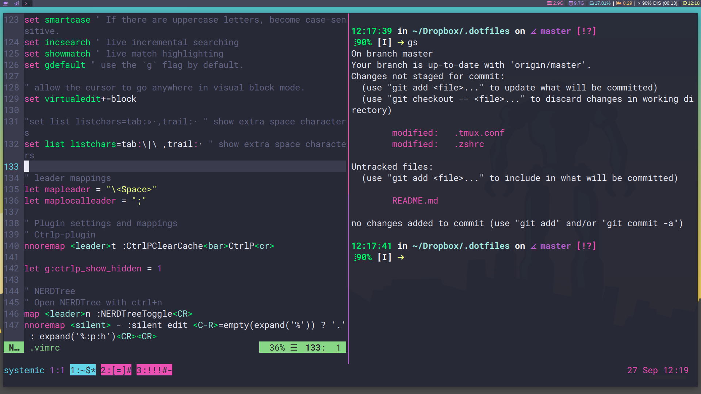
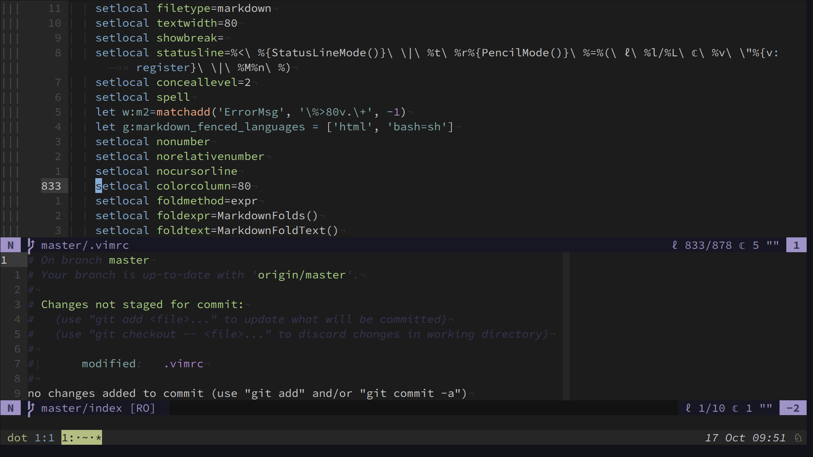

# Dotfiles
### Specific for i3wm, vim, tmux, and zsh.

> Seen in image:  
> Fonts: Adobe Source Code Pro (Regular), Roboto Mono, and Font-Awesome.  
> Color Scheme: Base16_Dracula.  
> Applications: Gnome Terminal, Vim, Tmux, and oh-my-zsh shell
> OS: i3wm.  

> Seen in image:
> Font: Source Code Pro for Powerline (Regular)
> Color Scheme: Iceberg
> Apllications: Gnome Terminal, NeoVim, Tmux, and oh-my-zsh shell
> OS: i3wm
